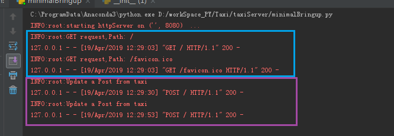
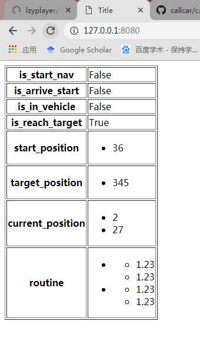

#### 关于叫车server近期工作报告

------

1. 采用http结构的server端服务实现。

   1. 用户对server上的用户数据的控制，对车数据的请求
   2. 车对server上的车数据的控制，对用户数据的请求
   3. （新增）server运行时，可以进行http请求的设备（手机电脑）可以向随时server请求当前关于订单全部信息，且不影响系统运行，但不能修改数据

2. 新增功能：

   1. 对服务器的访问请求与数据反馈会被记录：

      

      蓝色是一次电脑对订单数据的请求记录，紫色是来自车辆的一个数据提交和数据返回

   2. 请求订单

      从电脑：

      

      从手机：

      

   3. 鲁棒的出错处理和json信息校验

      1. json格式有误或缺少条目时向客户端抛出异常403，服务器不受影响
      2. 在非常小的可能情况下，如果多客户端频繁同时传入数据，保证出错处理而不让server宕机

   4. 断线重连

      1. http数据传输的机制保证服务端客户端不需要保持连接，仅尽可能保持最新信息

3. 下一步工作：

   1. 和简志强工作结果协调
   2. 租用服务器上线